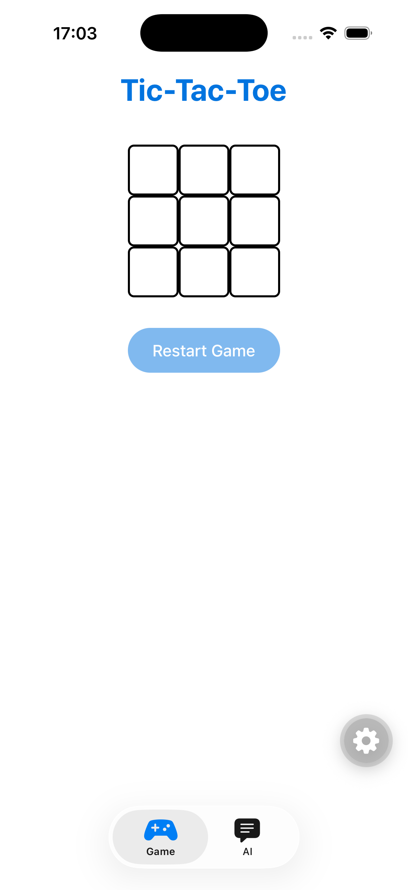
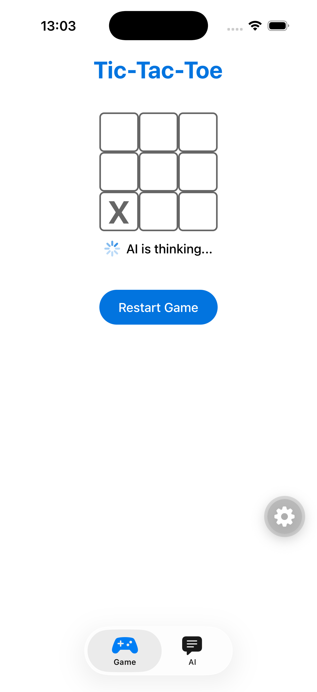
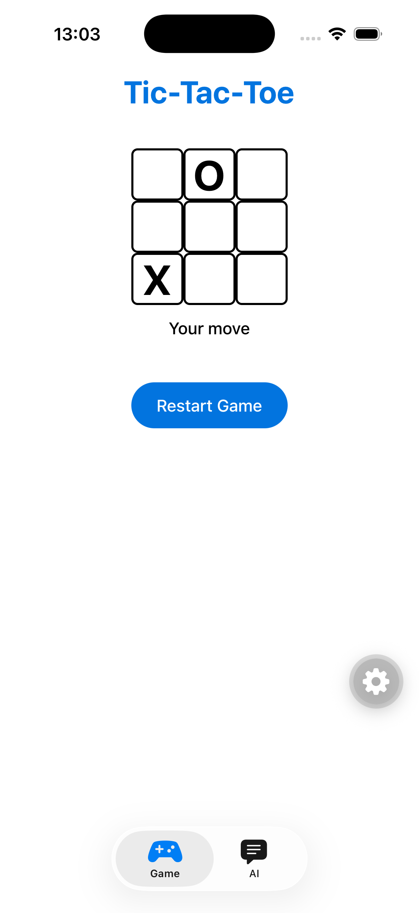
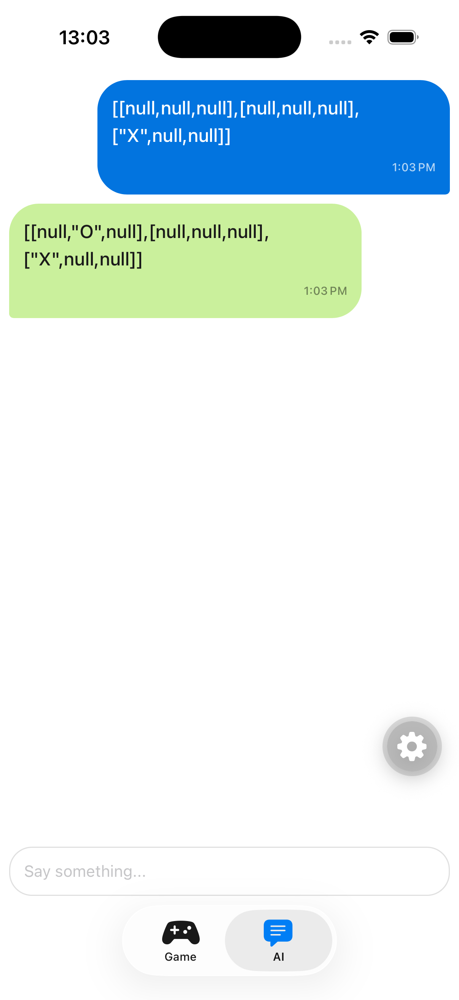
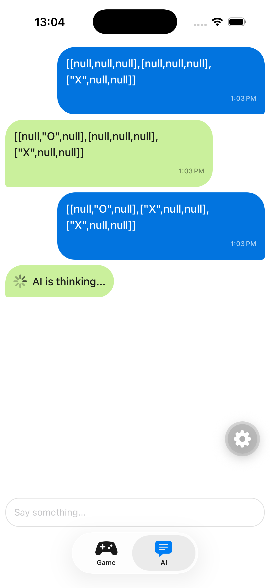

# expo-tic-tac-toe

## Project Overview

This is a cross-platform mobile and web application built with **Expo SDK 57** and **React Native 0.86.0**. It targets iOS, Android, and web from a single TypeScript/React codebase. The app features a Tic-Tac-Toe game played against an AI opponent and an AI chat screen that logs every exchange with the AI in a chat-style view, built on top of an Expo starter template with file-based routing, light/dark theme support, and platform-adaptive UI components.

The entry point is `expo-router/entry` (configured in `package.json`), and all screens are defined under `src/app/` using Expo Router's file-based routing convention.

## Screenshots

| Game start | AI thinking (Game) | Your move (Game) | Chat log (AI) | AI thinking (AI) |
|---|---|---|---|---|
|  |  |  |  |  |

## Technology Stack

- **Runtime**: Expo ^57.0.0, React Native 0.86.0, React 19.2.3
- **Language**: TypeScript ~6.0.3 (strict mode enabled)
- **Router**: expo-router ~57.0.8 with typed routes and `unstable-native-tabs`
- **Styling**: React Native `StyleSheet` + platform-specific CSS modules for web (`*.module.css`)
- **Animations**: react-native-reanimated 4.5.0, react-native-worklets 0.10.0
- **Images**: expo-image ~57.0.1
- **Icons**: expo-symbols ~57.0.1 (SF Symbols / Material icons)
- **Gestures**: react-native-gesture-handler ~2.32.0
- **Safe Areas**: react-native-safe-area-context ~5.7.0
- **In-App Browser**: expo-web-browser ~57.0.2
- **Device Info**: expo-device ~57.0.1
- **AI SDK**: `@ai-sdk/react` ^3.0.199 (`experimental_useObject`), `ai` ^6.0.197 (`streamText` + `Output.object`), `zod` ^4.4.3

## Project Structure

```
├── app.json                  # Expo configuration (plugins, experiments, native settings)
├── package.json              # Dependencies and npm scripts
├── tsconfig.json             # TypeScript config with path aliases
├── expo-env.d.ts             # Auto-generated Expo types (do not edit)
├── utils.ts                  # Shared utilities (generateAPIUrl)
├── src/
│   ├── app/                  # File-based routing screens and layouts
│   │   ├── _layout.tsx       # Root layout: ThemeProvider + AiProvider + AnimatedSplashOverlay + AppTabs
│   │   ├── index.tsx         # Home screen (welcome / getting started)
│   │   ├── explore.tsx       # Explore screen (feature showcase / docs links)
│   │   ├── game/
│   │   │   └── index.tsx     # Tic-Tac-Toe game screen
│   │   ├── ai/
│   │   │   └── index.tsx     # AI Chat screen (chat-style log of AI exchanges)
│   │   └── api/
│   │       └── chat+api.ts   # API route: POST handler streaming the AI move
│   ├── components/           # Reusable React components
│   │   ├── app-tabs.tsx      # Native tab navigator (unstable-native-tabs)
│   │   ├── app-tabs.web.tsx  # Web tab navigator (expo-router/ui Tabs)
│   │   ├── animated-icon.tsx / .web.tsx  # Animated splash icon
│   │   ├── board.tsx         # Tic-Tac-Toe board UI, state management and AI moves
│   │   ├── themed-text.tsx   # Text component with theme + typography variants
│   │   ├── themed-view.tsx   # View component with themed background colors
│   │   ├── external-link.tsx # Link that opens in-app browser on native
│   │   ├── web-badge.tsx     # Expo version badge (web only)
│   │   ├── hint-row.tsx      # Labeled hint row UI
│   │   └── ui/
│   │       ├── square.tsx    # Tic-Tac-Toe cell button
│   │       ├── my-button.tsx # Reusable pressable button
│   │       └── collapsible.tsx  # Animated collapsible section
│   ├── context/
│   │   └── ai.tsx            # AiProvider: shared useObject state + chat message history
│   ├── utils/
│   │   └── game-winner.ts    # Win-condition checker for Tic-Tac-Toe
│   ├── hooks/
│   │   ├── use-theme.ts      # Returns current theme color object
│   │   ├── use-color-scheme.ts     # Re-exports from react-native
│   │   └── use-color-scheme.web.ts # Web-aware hydration-safe color scheme
│   ├── constants/
│   │   ├── theme.ts          # Colors, fonts, spacing, layout constants
│   │   └── matrix.ts         # Zod schema for the 3x3 board matrix ("X" | "O" | null)
│   └── global.css            # CSS custom properties for web fonts
├── assets/
│   ├── images/               # PNGs: icons, splash, logos, tutorial, tab icons
│   └── expo.icon/            # iOS app icon assets
├── docs/
│   └── screenshots/          # App screenshots used in this document
├── scripts/
│   └── reset-project.js      # Utility to wipe src/ and start fresh
└── ios/                      # Generated native iOS project (prebuild)
```

## Path Aliases

TypeScript path mapping is configured in `tsconfig.json`:

- `@/*` → `./src/*`
- `@/assets/*` → `./assets/*`

Always use these aliases for imports instead of relative paths. The only exception is the root-level `utils.ts`, which is imported with a relative path (e.g. `../../utils` from `src/context/`).

## Build and Run Commands

| Command | Description |
|---------|-------------|
| `npm start` | Start the Expo development server |
| `npm run ios` | Build and run on iOS simulator / device (`expo run:ios`) |
| `npm run android` | Build and run on Android emulator / device (`expo run:android`) |
| `npm run web` | Start the web development server (`expo start --web`) |
| `npm run lint` | Run Expo's ESLint setup (`expo lint`) |
| `npm run reset-project` | Run the reset script to clear starter code |

The project uses Expo's **development build** workflow (not Expo Go). Install the dev client via `expo-dev-client`.

**Package manager**: the project uses **bun** (`bun.lock` is the only lockfile; `package-lock.json` was removed to avoid mixed lockfiles, which breaks EAS Build inference and `expo-doctor` checks). Use `bun install` / `bunx` instead of `npm install` / `npx` when adding packages, and prefer `bunx expo install <pkg>` for Expo modules so version validation against the SDK is applied. The `npm run ...` scripts above work with any package manager (e.g. `bun run ios`).

## Code Style Guidelines

- **TypeScript strict mode** is enabled.
- **Platform-specific code** is handled in two ways:
  1. `Platform.select()` or `Platform.OS` checks for small differences.
  2. Separate files with `.web.tsx` extension for larger platform forks (e.g., `app-tabs.web.tsx`, `animated-icon.web.tsx`, `use-color-scheme.web.ts`). Metro and Expo Router automatically resolve these.
- **Imports**: VS Code is configured to `organizeImports` and `sortMembers` on save.
- **Styling**: Prefer `StyleSheet.create()` over inline styles. Use the shared `Spacing` and `Colors` constants from `@/constants/theme` rather than hard-coding values.
- **Theming**: Always use `ThemedText` and `ThemedView` instead of raw `Text`/`View` so that light/dark mode works consistently. Access the theme object via `useTheme()`.
- **Typography**: Use the `type` prop on `ThemedText` for standard text styles (`default`, `title`, `subtitle`, `small`, `smallBold`, `link`, `linkPrimary`, `code`).

## Theme System

- Colors are defined in `src/constants/theme.ts` for both `light` and `dark` modes.
- `ThemeColor` keys: `text`, `background`, `backgroundElement`, `backgroundSelected`, `textSecondary`.
- Fonts are platform-selected (`sans`, `serif`, `rounded`, `mono`).
- Spacing scale: `half` (2), `one` (4), `two` (8), `three` (16), `four` (24), `five` (32), `six` (64).
- `BottomTabInset` is platform-aware (iOS: 50, Android: 80).
- `MaxContentWidth` is 800 for large-screen limiting.

## Routing and Navigation

- The app uses **file-based routing** via `expo-router`.
- `src/app/_layout.tsx` is the root layout. It wraps the app in a `ThemeProvider` and an `AiProvider`, and renders `AppTabs`.
- Tabs are registered in both `app-tabs.tsx` (native) and `app-tabs.web.tsx` (web). When adding a new tab, update **both** files.
- Current tabs: `index` (Home), `explore` (Explore), `game` (Tic-Tac-Toe), `ai` (AI Chat).
- New screens go in `src/app/` or nested directories. Layout files are named `_layout.tsx`.
- Server endpoints use Expo Router API routes: files named `*+api.ts` (e.g. `src/app/api/chat+api.ts` exposes `POST /api/chat`).

## Game Logic

The Tic-Tac-Toe implementation is split across `src/components/board.tsx` and `src/utils/game-winner.ts`:

- **Board state**: a 3×3 matrix (`("X" | "O" | null)[][]`, typed by the zod schema in `src/constants/matrix.ts`) managed with a single `useState` in `board.tsx`. Empty cells are `null`.
- **Turn alternation**: derived at render-time by counting existing X and O moves (`squares.flat().filter(...).length`) rather than storing a separate boolean flag. If `xCount > oCount`, the next player is O; otherwise X.
- **Move validation**: a cell that is already occupied (`!== null`) cannot be overwritten. This check lives inside the cell-mapping logic in `handleClick`.
- **Playing against the AI**: the human plays X, the AI plays O. `handleClick` computes the new board **outside** the `setSquares` updater, then calls `setSquares(operation)` and `submit(JSON.stringify(operation))` as separate statements. Never call `submit` (or any side effect) inside a `setState` updater: updaters must be pure and React may invoke them during render — doing so triggers "Cannot update a component while rendering a different component".
- **Applying the AI move**: a `useEffect` watches `object`/`isLoading` from `useAi()` and replaces the board with `object.content` only when the stream has completed (`!isLoading`). Partial streamed objects are ignored.
- **Response state feedback**: while `isLoading`, a status row below the board shows an `ActivityIndicator` with "AI is thinking..." and all cells are disabled (`Square` accepts a `disabled` prop, rendered with reduced opacity); `handleClick` also guards with `if (isLoading || winner) return;`. When idle and no winner, the status row shows "Your move". Cells stay disabled after a win.
- **AI errors**: `error` from `useAi()` is rendered below the board so failures are visible instead of silent.
- **Restart**: `handleRestart` resets the board and calls `clearMessages()` from the AI context, which also empties the chat log in the AI tab.
- **Win detection**: `calculateWinner(squares)` in `src/utils/game-winner.ts` checks all 8 winning combinations (3 rows, 3 columns, 2 diagonals) and returns the winning player or `null`.
- **Method chaining**: array operations (`.flat().filter().length`) are chained for conciseness.

## AI Integration

All AI communication is centralized in `src/context/ai.tsx` (`AiProvider`, mounted in the root layout, consumed via `useAi()`):

- **SDK**: Built with `experimental_useObject` from `@ai-sdk/react`, validated against the zod schema `z.object({ content: matrix })` — the same `matrix` schema (`src/constants/matrix.ts`) used by the API route. Client and server schemas must stay aligned.
- **Fetch**: Uses `expo/fetch` (passed as the `fetch` option) instead of the global `fetch` for native streaming compatibility.
- **Endpoint**: `generateAPIUrl('/api/chat')` (defined in `utils.ts` at the project root). Never use a relative URL like `/api/chat` directly: on native there is no origin and the request fails with `Network request failed`.
- **Environment**: In development, the API URL is derived from `Constants.experienceUrl`. In production, `EXPO_PUBLIC_API_BASE_URL` must be set.
- **API route**: `src/app/api/chat+api.ts` receives the board as a JSON string in the POST body, calls `streamText` with `Output.object({ schema })` and the model `anthropic/claude-3-haiku` (via the Vercel AI Gateway), and returns `result.toTextStreamResponse()`. The system prompt instructs the model to play as "O" and return the complete updated matrix with previous moves unchanged.
- **Credentials**: the route requires `AI_GATEWAY_API_KEY` in `.env.local` (git-ignored).
- **Message history**: the provider wraps `submit` so every request is recorded as a `user` message, and appends an `assistant` message with the received matrix when each stream completes. Messages are `ChatMessage` objects (`{ id, role: "user" | "assistant", text, timestamp }`) shared across tabs, so the AI tab also shows the moves made from the Game tab. `clearMessages()` empties the history.

## AI Chat Screen

The AI Chat screen lives in `src/app/ai/index.tsx`:

- **UI**: a chat-style scrollable list of message bubbles — user messages right-aligned (blue `#0274DF`, white text), assistant messages left-aligned (light green `#caf09c`, dark text). Each bubble shows a timestamp (`HH:mm`, device locale) under the text.
- **Response state feedback**: while `isLoading`, an assistant-style "AI is thinking..." bubble with an `ActivityIndicator` appears at the end of the list (also visible when the request was started from the Game tab, since the state lives in the shared provider), and the input is disabled (`editable={!isLoading}`).
- **Input**: a `TextInput` that calls `submit(text)` on send. Note the endpoint is the Tic-Tac-Toe move predictor, so free-text input still produces a board matrix (or a validation error), not a conversational reply.
- **Errors**: `error` from `useAi()` is rendered below the message list.

## Testing Instructions

There is **no test framework currently installed**. The README suggests following Expo's [Unit Testing with Jest](https://docs.expo.dev/develop/unit-testing/) guide if you want to add tests.

## Security Considerations

- The AI endpoint requires `AI_GATEWAY_API_KEY`, stored in `.env.local` (git-ignored). No keys are committed to the codebase.
- `.env*.local` files are ignored by `.gitignore`.
- Native signing keys and provisioning profiles (`*.jks`, `*.p8`, `*.p12`, `*.key`, `*.mobileprovision`) are git-ignored.
- The `ios/` directory is **not** git-ignored in the current `.gitignore` (the pattern `/ios` only matches the root but `.gitignore` has `/ios` listed; however the working tree shows `ios/` is present). Do not commit generated native folders unless you have a specific reason.

## Expo-Specific Configuration

- `app.json` enables two experiments:
  - `typedRoutes: true` — generates typed route definitions.
  - `reactCompiler: true` — enables React Compiler.
- Plugins: `expo-router`, `expo-splash-screen`.
- The app scheme is `expotictactoe`.
- Web output is **static** (`web.output: static`).

## Docs Reference

Read the exact versioned docs at https://docs.expo.dev/versions/v57.0.0/ before writing any code that uses Expo APIs.
